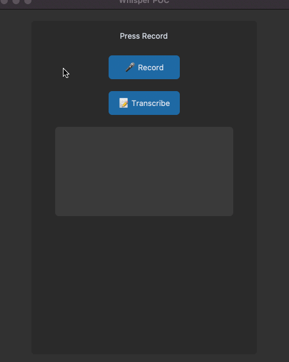

## Setup

Bare-bones starter to use OpenAI's **[Whisper voice-to-text tooling](https://github.com/openai/whisper)** in Python.

Heavily inspired by Boris Meinardus sample here: https://github.com/sudo-Boris/whisperapp

Note: this implementation is very basic: records for 10 seconds, writes audio data to disk, then reads that file, then produces a transcript from the input file and displays on the application



## Setup

- Install anaconda: https://www.anaconda.com/products/distribution/start-coding-immediately

- Create virtual environment & install deps (todo: requirements.txt)

```sh
conda create --name whisper_app python=3.9 -y
conda activate whisper_app
conda install pip
conda install --file requirements.txt
pip install git+https://github.com/openai/whisper.git
pip install tk
pip install customtkinter

```

<details>
<summary>One-liner</summary>

**[See the /scripts](./scripts/)** for setup examples

```sh
conda create --name whisper_app python=3.9 -y && conda activate whisper_app && conda install pip && pip install git+https://github.com/openai/whisper.git && pip install tk customtkinter && pip install sounddevice soundfile
```

</details>

## Model types

See **[here](https://github.com/openai/whisper/blob/main/README.md#available-models-and-languages)** for table source:

These models have time/performance trade-offs, if you know for sure you will only have English-language audio inputs you can append `.en` to the selected model type

|  Size  | Parameters | English-only model | Multilingual model | Required VRAM | Relative speed |
| :----: | :--------: | :----------------: | :----------------: | :-----------: | :------------: |
|  tiny  |    39 M    |     `tiny.en`      |       `tiny`       |     ~1 GB     |      ~32x      |
|  base  |    74 M    |     `base.en`      |       `base`       |     ~1 GB     |      ~16x      |
| small  |   244 M    |     `small.en`     |      `small`       |     ~2 GB     |      ~6x       |
| medium |   769 M    |    `medium.en`     |      `medium`      |     ~5 GB     |      ~2x       |
| large  |   1550 M   |        N/A         |      `large`       |    ~10 GB     |       1x       |

## resources

- https://github.com/openai/whisper#setup

## Stray useful

```sh

conda info --envs ## list env
conda deactivate
conda env remove -n whisper_app # destroy env
conda list -e > requirements.txt # eject deps to requirements.txt
```

---

Todo

- "real-time" transcription
- select model, task, other opts from UI & dropdown
- use requirements.txt w/ pinned versions
- Bug: text labels not updating
- clear textbox, other polish
