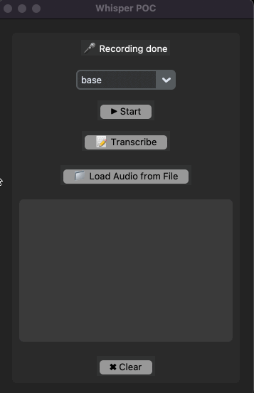
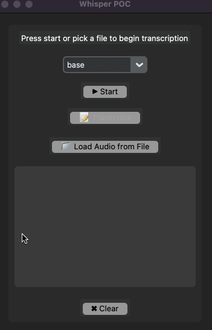

## Setup

Bare-bones starter to use OpenAI's **[Whisper voice-to-text tooling](https://github.com/openai/whisper)** in Python.

Heavily inspired by Boris Meinardus sample here: https://github.com/sudo-Boris/whisperapp

## Option A: microphone

Press the **start** button and speak into your machine's microphone for 10 seconds, then press the transcibe button



## Option B: Files

Press the **upload files button** select a **[flacc audio file](https://xiph.org/flac/)**



## Option C: Command line (CLI)

```sh
python cli.py --record # record 10 seconds and transcribe
python cli.py --record --duration 30 # record & transcribe for 30 seconds
```

```sh
python cli.py --model large --file scratch_audio.flac # transcribe
```

Model options: 'tiny.en', 'tiny', 'base.en', 'base', 'small.en', 'small', 'medium.en', 'medium', 'large-v1', 'large-v2', 'large'

## Setup

- Install anaconda: https://www.anaconda.com/products/distribution/start-coding-immediately

- Clone repo

```sh
git clone https://github.com/valgaze/whisper-tinker
cd whisper-tinker
```

- Create virtual environment & install deps

```sh
conda --version ## verify all's working well
conda create --name whisper_app python=3.9 -y
conda activate whisper_app
conda install pip
pip install -r requirements.txt
```

## Use it

```sh
python app.py # UI
python cli.py --record # CLI
python cli.py --file scratch_audio.flac --model base # CLI
```

<details>
<summary>One-liner</summary>

**[See the /scripts](./scripts/)** for setup examples

```sh
conda create --name whisper_app python=3.9 -y conda activate whisper_app conda install pip && pip install -r requirements.txt
```

Teardown/uninstall:

```
conda deactivate && conda env remove -n whisper_app
```

</details>

## Model types

See **[here](https://github.com/openai/whisper/blob/main/README.md#available-models-and-languages)** for table source:

These models have time/performance trade-offs, if you know for sure you will only have English-language audio input, you can append `.en` to the selected model type

|  Size  | Parameters | English-only model | Multilingual model | Required VRAM | Relative speed |
| :----: | :--------: | :----------------: | :----------------: | :-----------: | :------------: |
|  tiny  |    39 M    |     `tiny.en`      |       `tiny`       |     ~1 GB     |      ~32x      |
|  base  |    74 M    |     `base.en`      |       `base`       |     ~1 GB     |      ~16x      |
| small  |   244 M    |     `small.en`     |      `small`       |     ~2 GB     |      ~6x       |
| medium |   769 M    |    `medium.en`     |      `medium`      |     ~5 GB     |      ~2x       |
| large  |   1550 M   |        N/A         |      `large`       |    ~10 GB     |       1x       |

## resources

- https://github.com/openai/whisper#setup

- Boris Meinardus starter sample: https://github.com/sudo-Boris/whisperapp
